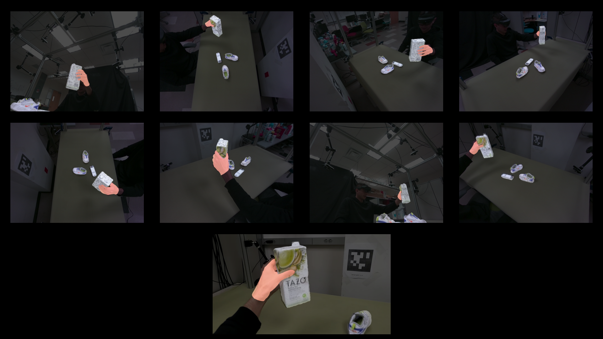
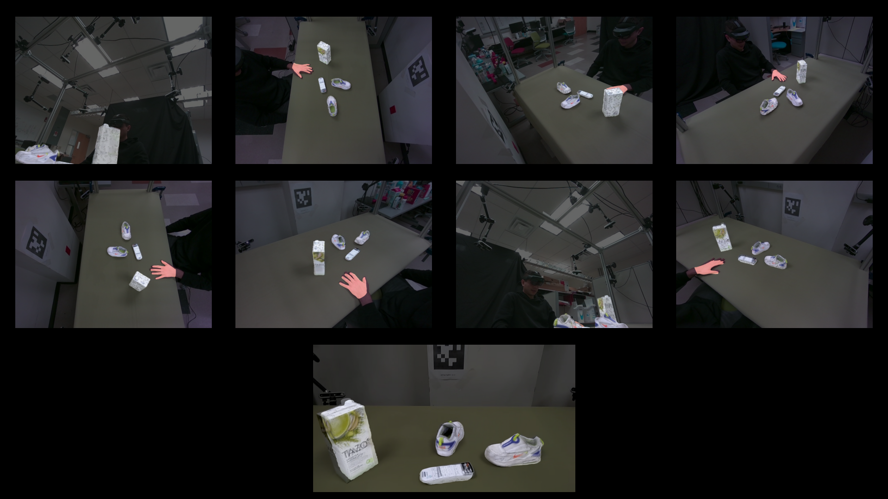
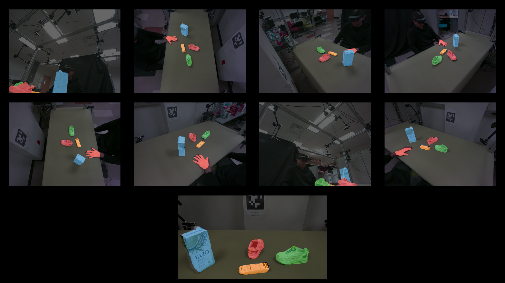

# HO-Cap Toolkit

[](https://www.python.org/downloads/release/python-3100) [](http://wiki.ros.org/melodic) [](https://pytorch.org/) 

The HO-Cap Toolkit is a Python package that provides evaluation and visualization tools for the HO-Cap dataset.

**HO-Cap: A Capture System and Dataset for 3D Reconstruction and Pose Tracking of Hand-Object Interaction**

Jikai Wang, Qifan Zhang, Yu-Wei Chao, Bowen Wen, Xiaohu Guo, Yu Xiang

[ [arXiv](https://arxiv.org/abs/2406.06843) ] [ [Project page](https://irvlutd.github.io/HOCap/) ]


---

## Contents

- [HO-Cap Toolkit](#ho-cap-toolkit)
  - [Contents](#contents)
  - [News](#news)
  - [BibTeX Citation](#bibtex-citation)
  - [License](#license)
  - [Installation](#installation)
  - [Download the HO-Cap Dataset](#download-the-ho-cap-dataset)
  - [Loading Dataset and Visualizing Samples](#loading-dataset-and-visualizing-samples)
  - [Evaluation](#evaluation)
    - [Hand Pose Estimation Evaluation](#hand-pose-estimation-evaluation)
    - [Novel Object Pose Estimation Evaluation](#novel-object-pose-estimation-evaluation)
    - [Novel Object Detection Evaluation](#novel-object-detection-evaluation)

## News

- **2024-06-24**: The HO-Cap dataset is released! Please check the [project page](https://irvlutd.github.io/HOCap/) for more details.

## BibTeX Citation

If HO-Cap helps your research, please consider citing the following:

```
@misc{wang2024hocap,
      title={HO-Cap: A Capture System and Dataset for 3D Reconstruction and Pose Tracking of Hand-Object Interaction}, 
      author={Jikai Wang and Qifan Zhang and Yu-Wei Chao and Bowen Wen and Xiaohu Guo and Yu Xiang},
      year={2024},
      eprint={2406.06843},
      archivePrefix={arXiv},
      primaryClass={id='cs.CV' full_name='Computer Vision and Pattern Recognition' is_active=True alt_name=None in_archive='cs' is_general=False description='Covers image processing, computer vision, pattern recognition, and scene understanding. Roughly includes material in ACM Subject Classes I.2.10, I.4, and I.5.'}
}
```


### License

HOCap Toolkit is released under the [GNU General Public License v3.0](LICENSE).


## Installation

This code is tested with [Python 3.10](https://docs.python.org/3.10) and CUDA 11.8 on Ubuntu 20.04. **Make sure CUDA 11.8 is installed on your system before running the code.**

1. Clone the HO-Cap repository from GitHub.

   ```bash
   git clone --rescursive git@github.com:IRVLUTD/HO-Cap.git
   ```

1. Change the current directory to the cloned repository.

   ```bash
   cd HO-Cap
   ```

2. Create conda environment

   ```bash
   conda create -n hocap-toolkit python=3.10
   ```

3. Activate conda environment

   ```bash
   conda activate hocap-toolkit
   ```

4. Install hocap-toolkit package and dependencies

   ```bash
   # Install dependencies
   python -m pip install --no-cache-dir -r requirements.txt

   # Build meshsdf_loss
   bash build.sh

   # Install hocap-toolkit
   python -m pip install -e .
   ```

5. Download models for external libraries

   ```
   bash download_models.sh
   ```

6. Download MANO models and code (`mano_v1_2.zip`) from the [MANO website](https://mano.is.tue.mpg.de) and place the extracted `.pkl` files under `config/ManoModels` directory. The directory should look like this:

   ```
   ./config/ManoModels
   ├── MANO_LEFT.pkl
   └── MANO_RIGHT.pkl
   ```


## Download the HO-Cap Dataset

1. Download the HO-Cap dataset from [box](https://utdallas.box.com/v/ho-cap-release).
2. Extract the dataset to the `./data` directory. And the directory should look like this:
   
   ```
   ./data
   ├── calibration
   ├── models
   ├── subject_1
   │   ├── 20231025_165502
   │   ├── ...
   ├── ...
   └── subject_9
      ├── 20231027_123403
      ├── ...
   ```

## Loading Dataset and Visualizing Samples

1. Below example shows how to visualize the pose annotations of one frame:
   
   ```bash
   python examples/sequence_pose_viewer.py
   ```

   

2. Below example shows how to visualize sequence by the interactive 3D viewer:
   
   ```bash
   python examples/sequence_3d_viewer.py
   ```

3. Below example shows how to offline render the sequence:
   
   ```bash
   python examples/sequence_renderer.py
   ```

   This will render the color image and segmentation map for all the frames in the sequence. The rendered images will be saved in the `<sequence_folder>/renders/` directory.

   
   


## Evaluation

HO-Cap provides the benchmark evaluation for three tasks:

- **Hand Pose Estimation** (A2J-Transformer[^1] and HaMeR[^2])
- **Novel Object Pose Estimation** (MegaPose[^3] and FoundationPose[^4])
- **Novel Object Detection** (CNOS[^5] and GroundingDINO[^6]).

The benchmark evaluation example results are stored under the ./config/benchmarks directory. If the evaluation results are saved in the same format, the evaluation codes below can be used to evaluate the results.

### Hand Pose Estimation Evaluation

- Evaluate the hand pose estimation performance:
   
   ```bash
   python examples/evaluate_hand_pose.py
   ```

   <details>
   <summary> You should see the following output: </summary>
     
   ```
   Evaluation results:
   ```
   
   </details>


### Novel Object Pose Estimation Evaluation

- Evaluate the novel object pose estimation performance using MegaPose and FoundationPose:
   
   ```bash
   python examples/evaluate_novel_object_pose.py
   ```

   <details>
   <summary> You should see the following output: </summary>
     
   ```
   Object_ID  ADD-S_err (cm)  ADD_err (cm)  ADD-S_AUC (%)  ADD_AUC (%)
       G01_1        0.622285      0.931847      95.251779    93.088153
       G01_2        1.722639      2.864552      88.236088    82.951038
       G01_3        3.603058      5.267925      80.363333    74.809918
       G01_4        3.319628      5.182604      81.892213    73.259688
       G02_1        2.876358      4.932917      83.108740    71.551933
       G02_2        2.311827      4.164094      85.415819    73.653125
       G02_3        2.053942      4.038427      86.666730    73.781861
       G02_4        2.156008      4.216609      85.868099    72.308455
       G04_1        2.291773      4.423770      84.896350    70.877876
       G04_2        2.277173      4.526859      84.796541    69.969442
       G04_3        2.262719      4.480607      84.811976    70.126703
       G04_4        2.187466      4.335308      85.241063    71.009475
       G05_1        2.202152      4.406457      85.158656    70.094175
       G05_2        2.150769      4.311178      85.284022    70.394463
       G05_3        2.101135      4.209764      85.459741    70.812713
       G05_4        2.049368      4.321723      85.748722    69.201963
       G07_1        2.239657      4.499831      84.288352    68.425880
       G07_2        2.283744      4.585382      84.192769    68.369226
       G07_3        2.289358      4.521216      84.392293    69.088029
       G07_4        2.453944      4.659746      83.901788    69.095688
       G09_1        2.335954      4.383290      84.421006    70.399909
       G09_2        2.207153      4.117222      84.960095    71.813927
       G09_3        2.335119      4.363489      84.739485    70.545486
       G09_4        2.314741      4.390959      84.742636    69.967545
       G10_1        2.287382      4.345581      84.872734    70.169253
       G10_2        2.292289      4.354261      84.920001    70.067050
       G10_3        2.286696      4.332340      84.864717    70.138265
       G10_4        2.350560      4.466639      84.312511    69.109810
       G11_1        2.478856      4.630755      83.580471    68.318521
       G11_2        2.517070      4.716128      83.381718    67.764666
       G11_3        2.497892      4.752518      83.509188    67.267398
       G11_4        2.608370      4.907855      82.847013    66.485662
       G15_1        2.607319      4.912701      82.787732    66.344681
       G15_2        2.604308      4.916133      82.790136    66.274095
       G15_3        2.603031      4.916675      82.782173    66.238405
       G15_4        2.629115      4.932682      82.644975    66.187657
       G16_1        2.606751      4.876389      82.686423    66.579694
       G16_2        2.583274      4.851990      82.732962    66.555754
       G16_3        2.636666      4.903458      82.405020    66.285514
       G16_4        2.613952      4.858562      82.467323    66.479288
       G18_1        2.623657      4.922163      82.487034    66.229327
       G18_2        2.623725      4.909405      82.459508    66.320043
       G18_3        2.605120      4.869260      82.583889    66.595389
       G18_4        2.582878      4.822793      82.745806    66.909936
       G19_1        2.579643      4.815924      82.741131    66.929992
       G19_2        2.594446      4.834087      82.630870    66.835297
       G19_3        2.589485      4.847906      82.652686    66.650070
       G19_4        2.598538      4.853894      82.662542    66.699528
       G20_1        2.590124      4.950461      82.710792    65.838859
       G20_2        2.572236      4.932026      82.833246    65.916376
       G20_3        2.542719      4.877217      83.028086    66.275407
       G20_4        2.576188      4.990698      82.730561    65.337352
       G21_1        2.563550      4.973498      82.796708    65.404425
       G21_2        2.556220      4.961612      82.823936    65.445065
       G21_3        2.588855      4.998793      82.592185    65.252844
       G21_4        2.608319      5.020533      82.438422    65.145589
       G22_1        2.584527      4.989324      82.588827    65.342481
       G22_2        2.635756      5.087002      82.387761    64.790779
       G22_3        2.643167      5.106887      82.358116    64.694632
       G22_4        2.680397      5.162142      82.094643    64.501227
     Average        2.680397      5.162142      83.829502    68.882950
   ```
   
   </details>


### Novel Object Detection Evaluation

- Evaluate the novel object detection performance:
   
   ```bash
   python examples/evaluate_novel_object_detection.py
   ```

   <details>
   <summary> You should see the following output: (click to expand) </summary>
     
   ```
    Average Precision  (AP) @[ IoU=0.50:0.95 | area=   all | maxDets=100 ] = 0.253
    Average Precision  (AP) @[ IoU=0.50      | area=   all | maxDets=100 ] = 0.279
    Average Precision  (AP) @[ IoU=0.75      | area=   all | maxDets=100 ] = 0.248
    Average Precision  (AP) @[ IoU=0.50:0.95 | area= small | maxDets=100 ] = 0.016
    Average Precision  (AP) @[ IoU=0.50:0.95 | area=medium | maxDets=100 ] = 0.276
    Average Precision  (AP) @[ IoU=0.50:0.95 | area= large | maxDets=100 ] = 0.249
    Average Recall     (AR) @[ IoU=0.50:0.95 | area=   all | maxDets=  1 ] = 0.549
    Average Recall     (AR) @[ IoU=0.50:0.95 | area=   all | maxDets= 10 ] = 0.549
    Average Recall     (AR) @[ IoU=0.50:0.95 | area=   all | maxDets=100 ] = 0.549
    Average Recall     (AR) @[ IoU=0.50:0.95 | area= small | maxDets=100 ] = 0.138
    Average Recall     (AR) @[ IoU=0.50:0.95 | area=medium | maxDets=100 ] = 0.562
    Average Recall     (AR) @[ IoU=0.50:0.95 | area= large | maxDets=100 ] = 0.388
   AP: 0.253 | AP_50: 0.279 | AP_75: 0.248 | AP_s: 0.016 | AP_m: 0.276 | AP_l: 0.249
   ```
   
   </details>


[^1]: [A2J-Transformer: Anchor-to-Joint Transformer Network for 3D Interacting Hand Pose Estimation from a Single RGB Image](https://arxiv.org/abs/2304.03635)
[^2]: [Reconstructing Hands in 3D with Transformers](https://arxiv.org/abs/2312.05251)
[^3]: [MegaPose: 6D Pose Estimation of Novel Objects via Render & Compare](https://arxiv.org/abs/2212.06870)
[^4]: [FoundationPose: Unified 6D Pose Estimation and Tracking of Novel Objects](https://arxiv.org/abs/2312.08344)
[^5]: [CNOS: A Strong Baseline for CAD-based Novel Object Segmentation](http://arxiv.org/abs/2307.11067)
[^6]: [Grounding DINO: Marrying DINO with Grounded Pre-Training for Open-Set Object Detection](https://arxiv.org/abs/2303.05499)
```
